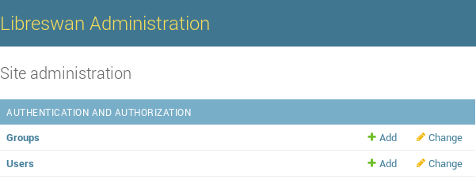
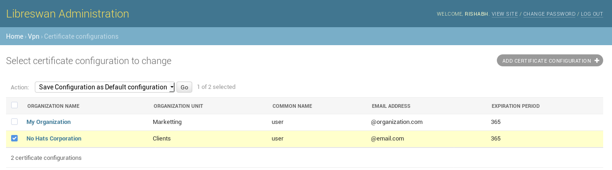
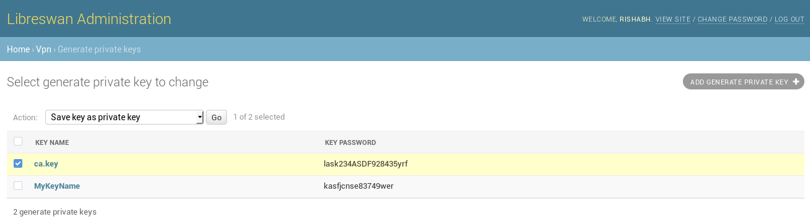
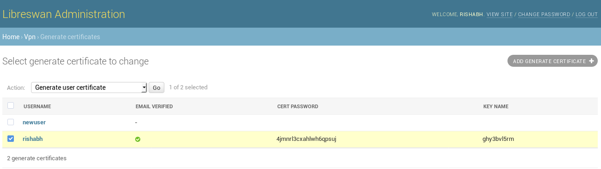
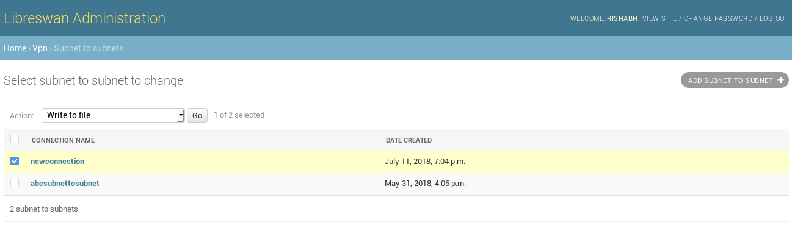
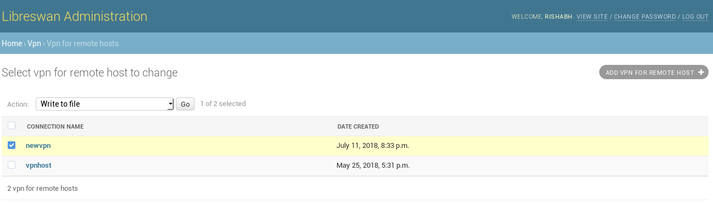
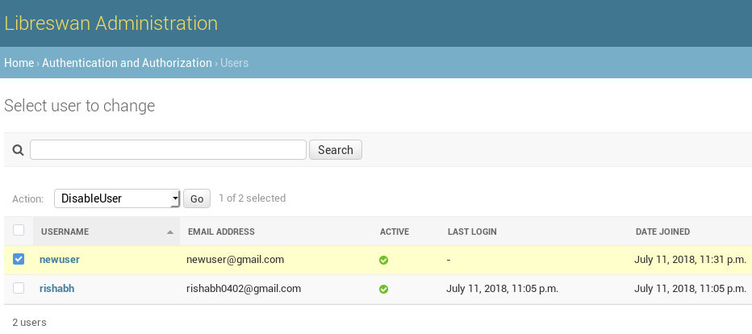

**Note** - Before Proceeding make sure you've read the [INSTALLATION INSTRUCTIONS](https://github.com/Rishabh04-02/Libreswan-managing-interface/blob/master/INSTALLATION_INSTRUCTIONS.md)

# Libreswan Administration Guide
This guide aims to improve user experience while using Libreswan Administration Interface.

## Functionalities 
* Add user
* Create certificate configurations (and set a configuration as default for generating user certificates)
* Generate Private Key (CA private key)
* Generate root certificate (Using CA private key)
* Account activation (email verification)
* Generate user certificates
* Create Subnet to Subnet VPN connection profiles
* Create VPN for remote host connection profiles
* Enable/Disable user

### Add user
This will add the user to the interface.

	http://your-server-ip:8000/admin/auth/user/add/

### Certificate configuration
This will let you add multiple certificate configuration to the interface. It will then provide an option to `Save configuration as Default configuration` which means saving the configuration which the user generated certificates will have.

	http://your-server-ip:8000/admin/vpn/certificateconfiguration/add/

Note - Please save any of the added configuration as default configuration before you begin to generate user certificates.

### Generate Private Key (CA private key)
This will generate a CA private key of the desired configuration (certificate configuration as mentioned above) and will be used to sign all the user certificates. User just need to choose `save key as private key` option after selecting the desired key name and password.

	http://your-server-ip:8000/admin/vpn/generateprivatekey/

### Generate root certificate
This will be generated using the CA private key. Just select the desired configuration and choose option `Generate root certificate`

	http://your-server-ip:8000/admin/vpn/generaterootcertificate/

### Account activation (email verification)
This lets the user to activate the account and hence use the functionality of the interface.
User can activate it's account by visiting the following link and entering the valid login credentials:
	
	http://your-server-ip:8000/activate_account/
After that user will receive an email on it's registered email id with the activation link. eg. sample mail sent to user:

	Subject: Hello newuser - Activate Your Libreswan Account
	From: noreply@libreswan.org
	To: newuser@gmail.com
	Hi ,
	Please click on the link below to confirm your registration:
	http://your-server-ip:8000/activate/MO/4uj-759a7a1a792880768519/

### Generate user certificates
This will generate the CA signed certificates for users.

#### Prerequisites
* User should have verified email(activated account) -
	It can be done by visiting the following link and entering the valid details:

		http://your-server-ip:8000/activate_account/
	On entering the valid credentials the user will get the account activation link in email (entered during adding user). [As for now the email's are printed on console for debugging. Will be changed later]. Here is one such link:

		http://your-server-ip:8000/activate/LQ/4xt-60306def302911f8e957/

	**Important** - But before the account can be activated the admin should have added the user by visiting 

		http://your-server-ip:8000/admin/vpn/generatecertificate/add/

* Admin should have saved default configuration (The 1st point)

### Create Subnet to Subnet VPN connection profiles
It lets you add and configure your connection and then saving the connection by using the option `write to file`

	http://your-server-ip:8000/admin/vpn/subnettosubnet/add/

### Create VPN for remote host connection profiles
It lets you add and configure your connection and then saving the connection by using the option `write to file`

	http://your-server-ip:8000/admin/vpn/vpnforremotehost/add/

### Enable/Disable user
It prevents user from login to this interface if it's account is disabled. When the user account is disabled user can't use any functionality of this interface. User can be Enabled by the administrator anytime.

	http://your-server-ip:8000/admin/auth/user/

