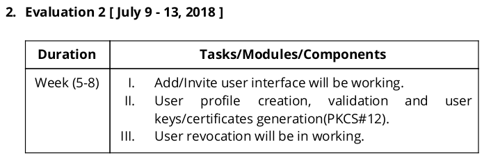

[This is a temporary file and will be removed (along with associated content eg. images) after the evaluation ends]
# Project status -

## Excerpt from Project proposal -

| Task/Components/Modules name | **Status** |
|-------------------------------|-----------|
|`Add/Invite user interface will be working.` | **Completed** |
| `User   profile   creation,   validation   and  keys/certificates generation(PKCS#12).` | **Completed** |
| `User revocation/Disabling will be in working.` | **Completed** |

## Work done after Evaluation 1 (Month Wise)-
### June
* Django app restructured and VPN interface redesigned for optimum use.
* Email verification (account activation) completed along with creation of user profiles.
* Environment- Python (from 2.7 to 3.5) and Django (from 1.11.13 to 2.0.6) Upgradations, Modules made compatible according to the environment upgrades.
* Certificate configuration options adding and upgrading:
	1. Adding Certificate configurations option added,
	2. Activate account option added on index page,
	3. Default certificate file created/updated,
	4. Setting configuration as default configuration option added
* Sample `openssl.cnf` created and added.

### July
* Root certificate generation completed along with enabling MySql strict mode (for security reasons).
* Configuration files created and added:
	File name and its use:
	1. openssl.cnf - It holds the configuration of openssl being used in the project
	2. serial - IT contains the no. of the latest certificate signed
	3. index.txt - It Contains the information regarding the certificate being signed
* Generating CA signed certificates completed along with some corrections and modifications.
* Interface installation instructions added:
	Following Installation Instructions added:
	1. Prerequisites (System)
	2. Steps to get the app running
	3. References
* Crutial updates: Fixed bug with database makemigrations
* Libreswan Administrative Guide added.

## Commit logs:

    commit 5d0809d74089407a75b5f7c1ad91b6f9d9f192dc
    Author: Rishabh04-02 <rishabh0402@gmail.com>
    Date:   Thu Jul 12 01:34:12 2018 +0530
    Libreswan Administrative Guide added
        
    guide to the administrator

    commit d9a1ab88afe96a8bee8c6381d20a01577470d3dc
    Author: Rishabh04-02 <rishabh0402@gmail.com>
    Date:   Thu Jul 12 01:19:57 2018 +0530
    Libreswan Administrative Guide added

    commit f1db318ccb339c6dd35eaca280dd0b9162f43759
    Author: Rishabh04-02 <rishabh0402@gmail.com>
    Date:   Wed Jul 11 23:49:02 2018 +0530
    some required changes

    commit 584417136b9a190b0e6e1045f00781ec2713f167
    Author: Rishabh04-02 <rishabh0402@gmail.com>
    Date:   Wed Jul 11 17:27:53 2018 +0530
    Crutial updates
        
    install instructions updated,
    Migrations causing AttributeError: fixed

    commit 7579b3b5fd3834d110ec927d14bd60bbd0c02bef
    Author: Rishabh04-02 <rishabh0402@gmail.com>
    Date:   Wed Jul 11 17:25:11 2018 +0530
    .gitignore updated
        
    .idea removed were PyCharm IDE's files

    commit 774f5854ace43e5b94229436b21e638bfeca004a
    Author: Rishabh04-02 <rishabh0402@gmail.com>
    Date:   Wed Jul 11 13:02:53 2018 +0530
    Readme updated - installation instructions added

    commit 9a22a8b7adf18195e7ab1e4abc01ad07e80024d9
    Author: Rishabh04-02 <rishabh0402@gmail.com>
    Date:   Wed Jul 11 13:00:36 2018 +0530
    installation instructions added
        
    Following Installation Instructions added:
    1) Prerequisites (System)
    2) Steps to get the app running
    3) References
    Settings updated to include database file

    commit f6d374be7ee27be716dc1649b82f7e2722659513
    Author: Rishabh04-02 <rishabh0402@gmail.com>
    Date:   Tue Jul 10 23:32:39 2018 +0530
    Modifications and Corrections
        
    Removing unnecessary fields
    deleting user certificate (csr saved for future use) although openssl is saving the generated user certs
    views.py - modification for django 2.0
    gitignore updated

    commit d0dc36eb55e1ddc794624837a074ea22d531043f
    Author: Rishabh04-02 <rishabh0402@gmail.com>
    Date:   Tue Jul 10 22:30:11 2018 +0530
    fetching the password of the saved(Admin selected) key done

    commit 62418a5a5d97e0414cd11736baca4c5d394fc927
    Author: Rishabh04-02 <rishabh0402@gmail.com>
    Date:   Mon Jul 9 09:41:07 2018 +0530
    Generating CA signed certificates
        
    The follwing commands have been used for the purpose:
    openssl req -newkey rsa:2048 -nodes -keyout keyname.pem -days 365
    openssl req -out keyname.csr -key keyname.pem -new -days 365
    openssl ca -batch -create_serial -config openssl.cnf -cert ca.root.pem -keyfile ca.key.pem -in keyname.csr -out certname.pem
    openssl pkcs12 -inkey keyname.csr -in certname.pem -export -out certificate.p12

    commit 257c3fa048ac67c417b8d468dca0d2b159e8a4c3
    Author: Rishabh04-02 <rishabh0402@gmail.com>
    Date:   Mon Jul 9 09:04:03 2018 +0530
    Configuration files added
        
    config/index.txt.attr
    config/index.txt.attr.old
    config/index.txt.old
    config/serial.old

    commit 6aeb210319f06508d66431d11a5a4c438f89770f
    Author: Rishabh04-02 <rishabh0402@gmail.com>
    Date:   Mon Jul 9 08:53:44 2018 +0530
    Configuration files added
        
    File name and its use:
    1) openssl.cnf - It holds the configuration of openssl being used in the project
    2) serial - IT contains the no. of the latest certificate signed
    3) index.txt - It Contains the information regarding the certificate being signed

    commit 93eea6ff545027e1c607835122ff9bdfd3ecbb7a
    Author: Rishabh04-02 <rishabh0402@gmail.com>
    Date:   Tue Jul 3 18:09:16 2018 +0530
    root certificate generation complete

    commit cbb2844ea02d6d283d25c4d07f329362512d09a1
    Author: Rishabh04-02 <rishabh0402@gmail.com>
    Date:   Tue Jul 3 14:46:15 2018 +0530
    MySQL strict mode enabled
        
    It is enabled to prevent data loss

    commit 64941012308ac5c7da77ca5ef7470ac78fb6c818
    Author: Rishabh04-02 <rishabh0402@gmail.com>
    Date:   Tue Jul 3 14:40:30 2018 +0530
    Root certificate generation complete
        
    ca.key.pem generated in config/private/ca.key.pem

    commit d0cc368c837e16a6a0dbbcf4b971af0e93d0ba72
    Author: Rishabh04-02 <rishabh0402@gmail.com>
    Date:   Sat Jun 30 09:14:23 2018 +0530
    sample openssl.conf added

    commit 7779d9e1464eb8d70398337e2e6233f21f06a3ef
    Author: Rishabh04-02 <rishabh0402@gmail.com>
    Date:   Fri Jun 29 19:37:01 2018 +0530
    Certificate coniguration updates
        
    1. Certificate configuration fetched from file
    2. Writing default configuration to file updated
    3. keys password length increased

    commit b746c310ff1169a8ce79058c3613ee55f7374aa9
    Author: Rishabh04-02 <rishabh0402@gmail.com>
    Date:   Fri Jun 29 15:29:13 2018 +0530
    Certificate configurations option added
        
    1. Adding Certificate configurations option added,
    2. Activate account option added on index page,
    3. Default certificate file created/updated,
    4. Setting configuration as default configuration option added

    commit b5e10c5963f8216839bf473d477421e9ae4931b0
    Author: Rishabh04-02 <rishabh0402@gmail.com>
    Date:   Fri Jun 29 10:18:56 2018 +0530
    python3.5 support complete

    commit 0352e442432df7b0e4ae27049117cd3c07485032
    Author: Rishabh04-02 <rishabh0402@gmail.com>
    Date:   Tue Jun 26 15:50:06 2018 +0530
    README modified according to latest changes

    commit 5ad2c4b8898a57d2bee7bd321833a1b29d07cbd8
    Author: Rishabh04-02 <rishabh0402@gmail.com>
    Date:   Tue Jun 26 15:42:56 2018 +0530
    environment and mail updates

    commit 803872e6c751d34ece7941a9051ccd0a21809098
    Author: Rishabh04-02 <rishabh0402@gmail.com>
    Date:   Tue Jun 26 14:53:48 2018 +0530
    Python and Django Upgradations
        
    Python version - 3.5.4, Django version - 2.0.6

    commit 94056b278544a88da9dd3ea01812bab99e29204f
    Author: Rishabh04-02 <rishabh0402@gmail.com>
    Date:   Mon Jun 25 20:45:33 2018 +0530
    email verification and User profiles merging
        
    working great together

    commit e63551402cd2ad3867c317c15a63f38f3a72efcc
    Author: Rishabh04-02 <rishabh0402@gmail.com>
    Date:   Mon Jun 25 14:06:59 2018 +0530
    email verification with user profile creation working

    commit d3c206ae46f32c31069094d97041818a83aa9501
    Author: Rishabh04-02 <rishabh0402@gmail.com>
    Date:   Mon Jun 25 12:42:15 2018 +0530
    Email verification working great

    commit 59c485960308858c5ded6b86cf683285f64675a2
    Author: Rishabh04-02 <rishabh0402@gmail.com>
    Date:   Mon Jun 18 14:21:26 2018 +0530
    .gitignore updated

    commit cd4e911eafbed833d7d2b8320a12d4e466eed364
    Author: Rishabh04-02 <rishabh0402@gmail.com>
    Date:   Mon Jun 18 11:53:40 2018 +0530
    re format

    commit 3bddedce1e6a8eb0593b590cfbbbddce7ef6faa0
    Author: Rishabh04-02 <rishabh0402@gmail.com>
    Date:   Mon Jun 18 11:46:39 2018 +0530
    restructure Django app - part 3

    commit 750493b15865b7cb9123f67c5677c250ba57c6b0
    Author: Rishabh04-02 <rishabh0402@gmail.com>
    Date:   Mon Jun 18 11:44:05 2018 +0530
    restructure Django app - part 2

    commit f41f8b22ac24417176aadf2779a020a4f5de1b21
    Author: Rishabh04-02 <rishabh0402@gmail.com>
    Date:   Mon Jun 18 11:43:52 2018 +0530
    restructure Django app - part 1
